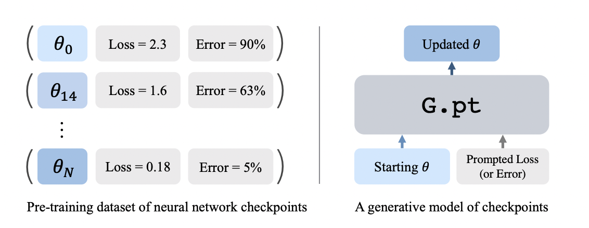
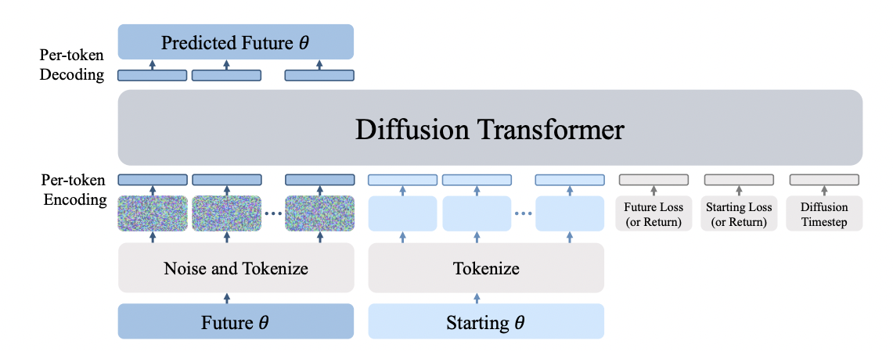
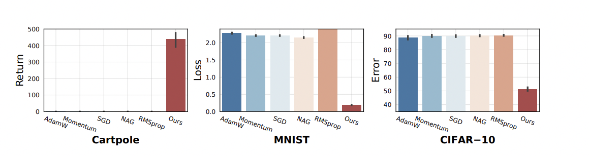
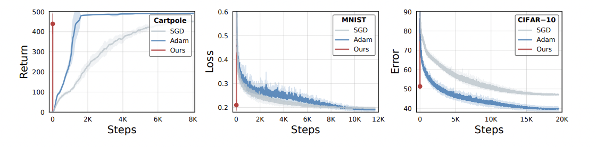
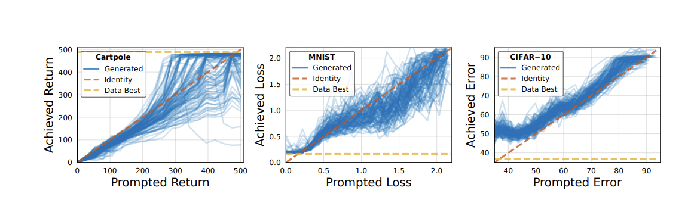
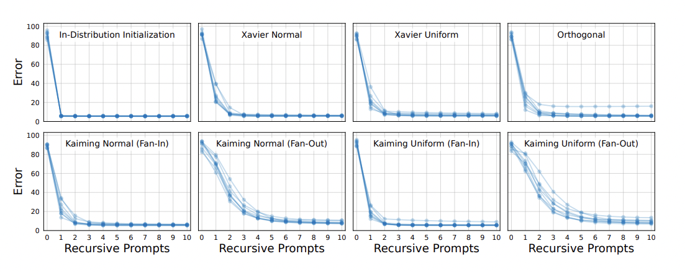
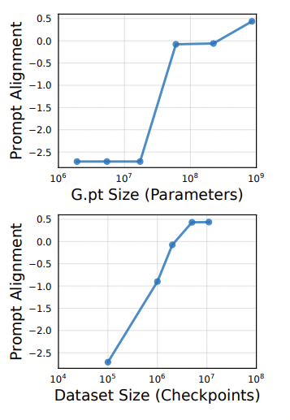
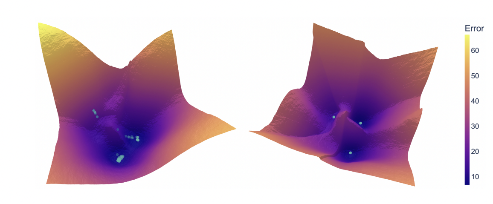

The general optimizers used to train neural networks like Adam and SGD are very efficeint in doing their job perfectly. They drive the entire learning process by making the convergence happen and enabling the model pick some patterns from the given data. But they do suffer from an important draw back of not being able to improve based on past experience. By past experience here we mean that running the same model with the same optimizer isn't going to essentially change the how fast the model is converging. With this being said, the exploration for learned optimizers has been in place for a while in the community. This paper explores a work in that particular direction.

Paper: [Learning to Learn with Generative Models of Neural Network Checkpoints](https://arxiv.org/pdf/2209.12892.pdf) 

Code: https://github.com/wpeebles/G.pt

## Introduction

Recent works in learned optimizers involve designing algorithms that learn via nested meta-optimization, where the inner loop optimizes the task-level objective and the outer loop learns the optimizer. However there are some issues employing these techniques because of the reliance on unrolled optimization and reinforcement learning component. The authors of this paper refer back to the concept of using checkpoints explored in the community and argue that these checkpoints contain rich information about parameters, metrics, losses and errors. They propose the use of checkpoint datasets instead of large chunk of datasets. The authors have created a dataset consisting of these checkpoints using standard daatsets like CIFAR, MNIST and Cartpole as part of this research. They claim to have included 23 million checkpoints within this dataset. The authors specifically explored generative pre training directly in the parameter space and employed transformer-based diffusion models of neural network parameters. 

#### Dataset for neural network checkpoints

The authors create the checkpoint dataset for the neural network training. They run optimizers like Adam and SGD and generate parameters and record various checkpoints. These checkpoints are augumented to the actual dataset to enable learned optimizer functioning.  Given a checkpoint (θ, l), we
construct augmented tuples (T (θ), l), where T (·) is the parameter-level augmentation. For creating a checkpoint (θ, l), they use a parameter level augumentation T(.) and for them to be valid, they need a fucntion fT (θ)(x) = fθ(x). They make use of permutation augumentation for this pupose. Using this permutation augumentation, the authors seek to permute the outgoing and incoming weights to preserve the output of the neural network.

Figure 1: The left side showing the checkpoint dataset along with the parameters, losses and errors. The right side showing the G.pt model (diffusion tranformer)

#### Generative model for neural network checkpoints

The authors use the dataset generated above to learn parmaters and create learned optimizer over the dataset. For this they propose a generative model that makes use of diffusion that could learn from these given paramters out of checkpoints. They use this diffusion model to learn the given parameters to generate future parameters (noisy). It will be outputting the (θ', l') set where θ' represents the future parameters and l' represents the prompted loss. The θ value and l value represent the input parameter set and loss value of the model. The diffusion model attempts the signal over loss prediction and the loss would be denoted by:

                                   L(G) = E[||c' − G(θ'j, θ, l', l, j)||]
                                  
The generative diffusion model is a tranformer model and the authors employ the architecture shown in Figure 2 to create a learned optimizer. They use the layered tokenization aproach to pass parameters through the network. This is to accomodate the variable of parameters observed after every layer in a neural network. In each case, the parameters are tokenized into a single token. For layers having really large amounts of parameters (larger networks too), the layers will be flattened first and chuncked into multiple tokens of size M where M is the maximum size of parameters that could be converted to a single token. The scalar values like l and l' are also tokenized and are gifven to the diffusion transformer just as shown in the figure. As shown in figure they employ simple linear per token encoders and per token decoders. The decoders take in the output from the transformer to the future parameter vector and decode it back to its original size. There is no weight sharing between the decoders. There is a global residue connection from the input to the end of the transformer to make sure that the prediction update comes from θ' - θ rather than just the θ' itself. 

Figure 2: The model architecture for G.pt. 

For creating the checkpoint dataset, the MNIST dataset is trained on CNN network (2layer convolution and 10 layer MLP) for 25 epochs and the CIFAR dataset is trained on the CNN for 50 epochs with learning rate 0.1, weight decay 5e-4 on SGD with momentum 0.9. The RL Catpole dataset is trained  using the IsaacGym simulator. They use a a three-layer MLP with 32 hidden units and SeLU activations. They make use of exponential moving average (EMA) of G.pt weights over the course of training. Their diffusion transformer uses a hidden dimension between 1536 and 2048 depending on dataset and has 12 hidden layers with 12-16 heads for self-attention. Then they employ learned positional embeddings across all tokens, initialized to zero.

## What issues other approaches had

#### Learning optimizers

Past works have explored parameterizing optimization update rules withneural networks in place of hand-designed rules like Adam. These rules can be parameterized implicitly as neural networks that take gradients as input and output an improved parameter update. They are typically trained with unrolled optimization or reinforcement learning which made the reliance on these models a little skeptical.

#### Hypernetworks

Rather than parameterizing update rules, neural networks can be used to directly output or modify other neural networks’ parameters. For example, hypernetworks train parameter regression networks end-toend with the task objective. Hypernetworks have subsequently been extended to support sampling different parameter solutions. However, in terms of efficiency, G.pt stands better interms of loss reduction with only single update.   

#### Model-agnostic meta-learning

MAML learns a parameter initialization that is rapidly adaptable to new tasks. Subsequent work has built simple probabilistic models over learned MAML initializations. These methods possess similar characteristics as learned optimizers—they rely on unrolled optimization and require differentiable task-level objectives.

#### Learning hyperparameters 

A large body of prior work has explored learning hyperparameters of standard optimizers. For example, learning rates, weight decays and weight initializations can all be learned via hypergradient descent, Bayesian optimization and reinforcement learning.

#### Effectiveness of Learning to learn as pre-training 

In contrast to learned optimizers, hypernetworks and MAML, G.pt pre-trains from vast amounts of trained neural network checkpoints. This method does not backpropagate through task-level losses and, as a result, does not require the task metric being optimized for to be differentiable. This allow us to train with standard generative modeling techniques instead of reinforcement learning or unrolled optimization which can be unstable.

## Why G.pt is efficient than other approaches in the community

The paper explores a new direction of utilizing the checkpoint datasets that enable learned optimizer that could effectively learn about the model something everytime it runs through the dataset unlike Adam and SGD optimizers. This paper proposes a simple, scalable and data driven approach which instead of relying on large datasets, makes use of checkpoint datasets unlike other models which tend to rely on unrolled optimizations that could be costly. The following reasons explain why G.pt is most suited for this application. 

1. It is able to rapidly train neural networks from unseen initializations with just one parameter update. 
2. It can generate parameters that achieve a wide range of prompted losses, errors and returns.
3. It is able to generalize to out-of-distribution weight initialization algorithms. 
4. As a generative model, it is able to sample diverse solutions. 
5. It can optimize non-differentiable objectives, such as RL returns or classification errors.

As mentioned earlier, G.pt performs better than other optimizers only with a single update. Optimizers like Adam and SGD require hundreds or even thousands of updates to achieve this. The results shown in Figure 3 show the sharp distinction between these optimizers in terms of their efficiency in the first step update. Now a single step comparision between these optimizers might not be a fair baseline for comparision. Therefore, the author explain that their model still performs well in a single step vs thousands of steps on other optimizers as shown in Figure 4.

By prompting for various desired losses, errors, or returns, G.pt can sample different parameter updates that achieve a range of performance levels. Figure 5 shows that G.pt successfully learns to generate parameters corresponding to a large range of prompted values.  Across different tasks and metrics, G.pt generates parameter updates that are well-correlated with the prompted value. While the model is able to achieve a range of prompted values, it is noted that it currently shows limited ability to extrapolate to values beyond the limits of the pre-training dataset.

The networks in the checkpoint dataset are initialized with a single weight initialization scheme. For MNIST, they are sampled θ ∼ U[− 1/√n, 1/√n], where n is the fan-in of a layer.  While one step prompting performance is degraded, recursive promptingsignificantly improves results. G.pt is able to rapidly optimize out-of-distribution weights in ten or fewer parameter updates. Figure 6 shows evaluation of G.pts ability to generalize to randomly-initialized input parameter vectors θ, where the weights are sampled from different distributions.

The effect of increasing the G.pt parameters is shown in Figure 7.  The training process invloves six models withtransformer hidden sizes in \[64, 128, 256, 512, 1024, 2048\]. The smallest model is approximately 2M parameters while the largestis 858M parameters. The G.pt checkpoint that attains the highest prompt alignment score over training is evaluated. We can infer that the larger models generalize much more effectively than smaller models. Small models (<60M parameters) largely fail to generalizeto unseen parameter vectors. Even at roughly 109 parameters, wefind that G.pt has not saturated its model scaling curve.

The impact of increasing the number of training checkpoints in also investigated (figure 7). The largest 858M parameter model is trained on \[500, 5K, 10K, 25K, 55K\] runs, with each run containing 200 checkpoints. Performance improves substantially as the number of training checkpoints is scaled from
100K to 5M. There is no significant improvement when further increasing from 5M to 10M checkpoints. This may be a result of G.pt requiring additional model scale to benefit from a larger pre-training dataset.

The mapping of loss values to neural network parameters is one-to-many. As a generative model, G.pt is able to sample diverse parameter solutions given a loss prompt \[Figure 8\]. Visual inspection of generated first-layer weights suggests that sampling noise controls subtle variations in individual filters as well as the specific ordering of filters. Intuitively, conditioning on a starting θ should narrow the space of possible parameter solutions (in other words, initialization should have some bearing on where optimization converge). 

Figure 3: Figure showing the reduction of losses and errors for each optimizer after a single update.

Figure 4: Figure showing the reduction of losses and errors for proposed optimizer (single step) vs other optimizers (thousands of steps)

Figure 5: Figure showing achieved losses, errors and returns across a range of inputs G.pt prompts. Each blue curve corresponds to a different randomly-initialized input parameter vector.

Figure 6: Error shown by G.pt in different distributions.

Figure 7: Figure showing the Scaling of the model wrt parameter size and data size. 

Figure 8: Visualization of the test error landscape for an MNIST MLP via parameter space PCA directions.

## Summary

The work overall has demonstrated some great results and efficiency in terms of simplicity, scalability and reliability. The approach demonstrated rapid optimization of neural networks across tasks (supervised and reinforcement learning) and metrics (losses, errors, returns). It addressed stable solution to the learning problem and addressed specifically what makes their approach better. They have also enlisted certain drawbacks their model suffered like signs of underfitting on the dataset, struggling to extrapolate losses and error not present in pre-training data, pretraining only for single architecture and single task data and considering relatively simple datasets of neural networks with static optimizer hyperparameters. Despite these limitations, the model addresses the issues in the community properly and sets up a path for future work in the field.

## References
1. Sepp Hochreiter, A Steven Younger, and Peter R Conwell. Learning to learn using gradient descent. In ICANN, 2001.
2. A Steven Younger, Sepp Hochreiter, and Peter R Conwell. Meta-learning with backpropagation. In IJCNN, 2001.
3. Karol Gregor and Yann LeCun. Learning fast approximations of sparse coding. In ICML, 2010.
4. Marcin Andrychowicz, Misha Denil, Sergio Gomez, Matthew W Hoffman, David Pfau, Tom Schaul, ´ Brendan Shillingford, and Nando de Freitas. Learning to learn by gradient descent by gradient
descent. In NeurIPS, 2016.
5. Sachin Ravi and Hugo Larochelle. Optimization as a model for few-shot learning. In ICLR, 2017.
6. Olga Wichrowska, Niru Maheswaranathan, Matthew W. Hoffman, Sergio Gomez Colmenarejo, Misha ´ Denil, Nando de Freitas, and Jascha Sohl-Dickstein. Learned optimizers that scale and generalize. In ICML, 2017.
7. Luke Metz, Niru Maheswaranathan, Jeremy Nixon, Daniel Freeman, and Jascha Sohl-Dickstein. Understanding and correcting pathologies in the training of learned optimizers. In ICML, 2019.
8. Jurgen Schmidhuber. Learning to control fast-weight memories: An alternative to dynamic recurrent networks. Neural Computation, 1992.
9. David Krueger, Chin-Wei Huang, Riashat Islam, Ryan Turner, Alexandre Lacoste, and Aaron Courville. Bayesian hypernetworks. arXiv:1710.04759, 2017.
10. Lior Deutsch, Erik Nijkamp, and Yu Yang. A generative model for sampling high-performance and diverse weights for neural networks. arXiv preprint arXiv:1905.02898, 2019.
11. Neale Ratzlaff and Li Fuxin. Hypergan: A generative model for diverse, performant neural networks. In ICML, 2019.
12. Chelsea Finn, Pieter Abbeel, and Sergey Levine. Model-agnostic meta-learning for fast adaptation of deep networks. In ICML, 2017.
13. James Bergstra, Remi Bardenet, Yoshua Bengio, and Bal azs K egl. Algorithms for hyper-parameter optimization. NeurIPS, 2011.
14. Dougal Maclaurin, David Duvenaud, and Ryan Adams. Gradient-based hyperparameter optimization through reversible learning. In ICML, 2015.
15. Harris Drucker and Yann Le Cun. Improving generalization performance using double backpropagation. IEEE Transactions on Neural Networks, 1992.
16. Jasper Snoek, Hugo Larochelle, and Ryan P Adams. Practical bayesian optimization of machine learning algorithms. NeurIPS, 2012.
17. Chang Xu, Tao Qin, Gang Wang, and Tie-Yan Liu. Reinforcement learning for learning rate control. arXiv:1705.11159, 2017.
18. Diogo Almeida, Clemens Winter, Jie Tang, and Wojciech Zaremba. A generalizable approach to learning optimizers. arXiv:2106.00958, 2021.
